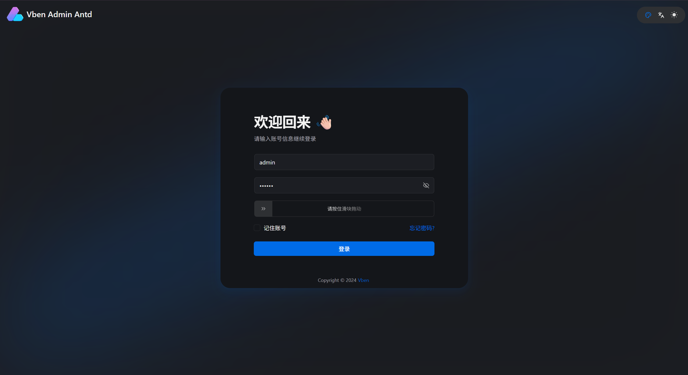
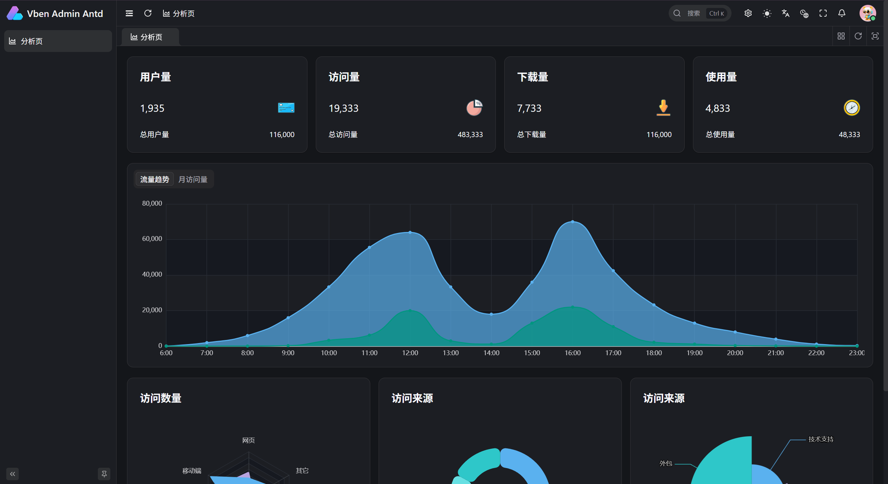

# Vben Admin Antd Lite

Vben Admin Antd Lite is a lightweight admin frontend template based on [Vue Vben Admin](https://github.com/vbenjs/vue-vben-admin). The project keeps the Ant Design Vue application and the local mock backend, while removing the default multi-app setup, demo menus, demo pages, demo APIs, and unnecessary login methods. It is suitable as a clean starting point for real business systems.

Because I tend to prefer a clean project baseline and often need to repeat the same simplification work for every new project, and because others may have the same need, this project turns that deep cleanup into a Lite version. It will continue to be updated according to real usage scenarios.

## Preview

### Login Page



### Main Page



## Simplified Content

### Applications

Kept only:

- `apps/web-antd`: Ant Design Vue frontend application
- `apps/backend-mock`: local mock API service
- `apps/docs`: local Docs documentation

Removed:

- `playground`
- `web-antdv-next`
- `web-ele`
- `web-naive`
- `web-tdesign`

### Menus and Pages

- Removed default project, demo, system menus and submenus.
- Removed the Workbench page and its related common-ui components.
- Kept the Analytics page and changed it to a first-level menu.
- Changed the default home page to `/analytics`.

### Login Page

- Fixed the login page to the centered layout.
- Removed the login layout selector.
- Removed the create-account entry.
- Removed mobile / verification-code login.
- Removed QR code login.
- Removed third-party login entries.
- Removed the role selector.

### Preferences and Copyright

- Removed the display text related to "Custom Preferences / Real-time Preview".
- Removed ICP record number and ICP website link fields.
- Changed copyright configuration to environment variables:

```env
VITE_APP_COPYRIGHT_ENABLE=true
VITE_APP_COPYRIGHT_COMPANY_NAME=Vben
VITE_APP_COPYRIGHT_COMPANY_SITE_LINK=https://www.vben.pro
VITE_APP_COPYRIGHT_DATE=2024
```
